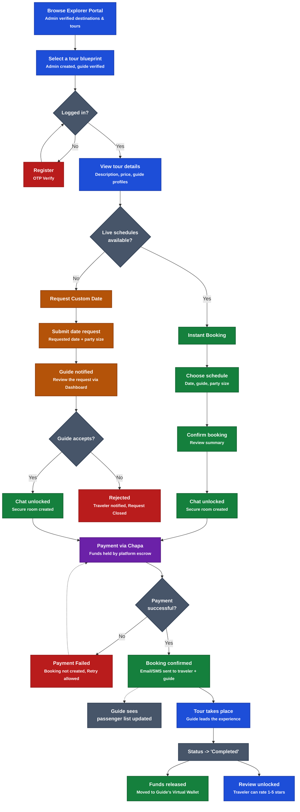

# Kambata Travel Booking Flow Architecture

The following diagram maps out the complete end-to-end booking flow for the Kambata Travel platform, detailing both the Instant Booking and Custom Request pathways.

## Flow Description

1. **Discovery & Auth**: Travelers browse admin-vetted locations. They must pass OTP authentication to proceed with interactions.
2. **The Crossroads**: The flow hinges entirely on whether a Guide has proactively created a schedule for an Admin-approved Tour Blueprint.
3. **Instant Booking**: If a schedule exists, the traveler immediately claims available slots.
4. **On-Demand Booking**: If no schedule exists, the traveler negotiates a custom date with a local expert. The guide must manually approve the date.
5. **Financial Safety**: The **Chat System** acts as a bridge before payment, ensuring travelers and guides can align on details. However, **Funds** are collected via Chapa and held by the platform escrow.
6. **Completion**: Funds are only released to the Guide's wallet after the tour successfully takes place, at which point the traveler is also unlocked to leave a public review.
