# Kambata Travel Guide Flow Architecture

The following diagram maps out the complete 7-phase journey for Local Experts (Guides) on the Kambata Travel platform, from initial registration to continuous monitoring.

```mermaid
graph TD
    %% Styling Classes
    classDef guide fill:#0f766e,stroke:#0f52ba,stroke-width:2px,color:#ffffff,font-weight:bold;
    classDef admin fill:#1e3a8a,stroke:#1e40af,stroke-width:2px,color:#ffffff,font-weight:bold;
    classDef payment fill:#6b21a8,stroke:#581c87,stroke-width:2px,color:#ffffff,font-weight:bold;
    classDef decision fill:#475569,stroke:#334155,stroke-width:2px,color:#ffffff,font-weight:bold;
    classDef warning fill:#b45309,stroke:#92400e,stroke-width:2px,color:#ffffff,font-weight:bold;
    classDef danger fill:#b91c1c,stroke:#991b1b,stroke-width:2px,color:#ffffff,font-weight:bold;
    classDef success fill:#15803d,stroke:#166534,stroke-width:2px,color:#ffffff,font-weight:bold;

    %% 1. Registration
    A[Create Account<br/><small>Name, email, password</small>]:::guide --> B[Status: 'Pending Verification'<br/><small>Dashboard locked</small>]:::warning
    
    %% 2. Profile Setup
    B --> C[Complete Profile<br/><small>Bio, experience, languages</small>]:::guide
    C --> D[Upload Document Vault<br/><small>Gov ID + Tour Guide License</small>]:::guide
    D --> E[Submitted - Awaiting Admin]:::warning

    %% 3. Admin Review (Security Gate)
    E --> F[Admin Reviews Documents<br/><small>Admin Portal Inspection</small>]:::admin
    F --> G{Admin Decision}:::decision
    
    G -- Reject --> H[Rejected<br/><small>Locked with no appeal path</small>]:::danger
    G -- Approve --> I[Approved<br/><small>Full Access</small>]:::success

    %% 4. Scheduling
    I --> J[Browse Tour Blueprints<br/><small>Admin-created, read-only</small>]:::guide
    J --> K[Create a Live Schedule<br/><small>Date, capacity</small>]:::guide
    K --> L[Schedule Goes Live<br/><small>Visible in Explorer Portal</small>]:::success

    %% 5. Booking Management
    L --> M{Booking Type}:::decision
    
    M -- Instant --> N[Instant Booking Arrives<br/><small>Auto-confirmed, payment held</small>]:::success
    M -- Request --> O[Custom Date Request<br/><small>Guide must accept/reject</small>]:::warning
    
    O --> P{Accept or Reject?}:::decision
    P -- Reject --> Q[Rejected<br/><small>Traveler notified</small>]:::danger
    P -- Accept --> R[Chat Unlocked<br/><small>Secure room opened</small>]:::success
    
    N --> S[View Passenger List<br/><small>Manage active schedule</small>]:::guide
    R --> S

    %% 6. Financials
    S --> T[Tour Status -> 'Completed']:::decision
    T --> U[Funds -> Guide Wallet<br/><small>Minus platform commission</small>]:::payment
    U --> V[Request Bank Payout<br/><small>Direct bank transfer</small>]:::payment

    %% 7. Ongoing Monitoring (Floating Box)
    subgraph Admin Monitoring
    W[Complaints / Rating drops]:::admin --> X[Block / Suspend<br/><small>Scheduling revoked</small>]:::danger
    end
    
    V -.-> W

```

## Flow Description (The 7 Phases)

1. **Registration**: A guide signs up with basic credentials but immediately lands in a locked "Pending Verification" state. They cannot host tours yet.
2. **Profile Setup**: The guide must complete their professional profile (bio, experience, languages) and upload their Document Vault (Government ID + Tour Guide License). This is a gate they completely control.
3. **Admin Review (The Security Gate)**: An admin manually inspects the documents in the Admin Portal and makes a binary decision. Approved unlocks everything. Rejected keeps the dashboard locked permanently (no current re-submission or appeal path).
4. **Scheduling**: Once approved, the guide browses admin-created tour blueprints and publishes their own Live Schedules on top of them. The guide owns the "when" and the capacity; the admin owns the "what."
5. **Booking Management**: Instant bookings arrive auto-confirmed. Custom date requests require manual acceptance. The chat room unlocks once a booking is in place, and the guide gets a passenger list to manage.
6. **Financials**: Funds held during booking are released to the guide's virtual wallet the moment the tour is marked "Completed," minus the platform commission. The guide can then request a payout to their bank account.
7. **Monitoring**: Running in the background at all times: Admins can block or suspend any guide based on complaints or rating drops, instantly revoking their scheduling privileges.
